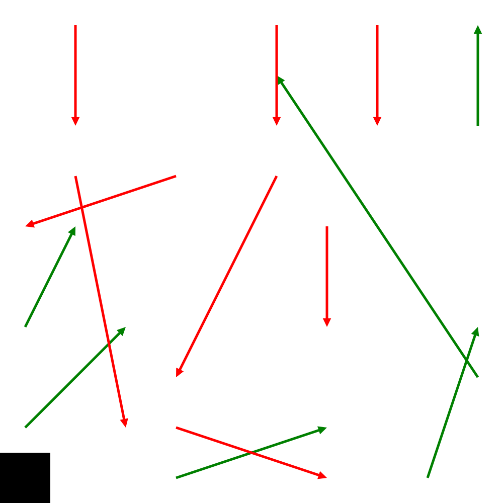

# A Snakes and Ladders Game State Probability Simulation

Calculates the probabilities of being in any given square for any given turn of a game of snakes and ladders. Outputs this as frames of an image that can be used to create an animation like the following:

The rules used for this version of snakes and ladders include:

* Landing on a snake or a ladder carries you down or up to the target square
* You must land exactly on the final square to win, or you bounce back
* You roll only once, even if you get a 6.

This project was developed quickly as a proof of concept and has not been thoroughly tested. It may include bugs.

## Development

Build and run using the supplied tasks for VS Code, or use the following commands:

    npm run build
    npm run launch

## Creating a Gif

On Linux you can create a gif using Imagemagick:

    convert -delay 30 -loop 0 output/*.png animation.gif

## License

MIT Licensed, except for the function `Draw._drawArrow()` which is adapted from https://stackoverflow.com/a/26080467 (SteampunkWizard) licensed under CC BY-SA 4.0
